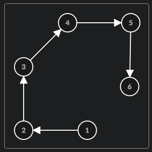
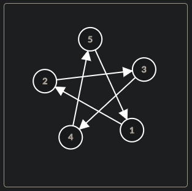
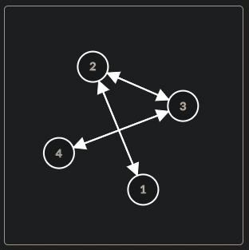
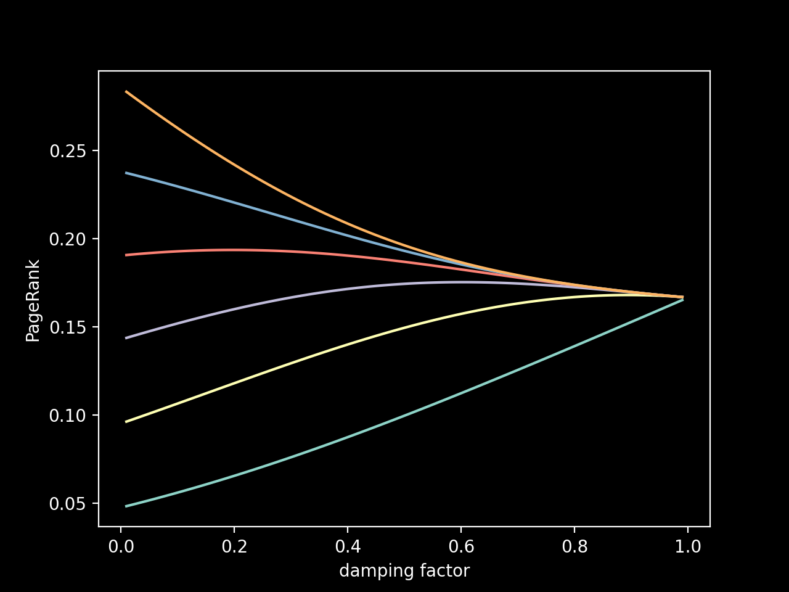
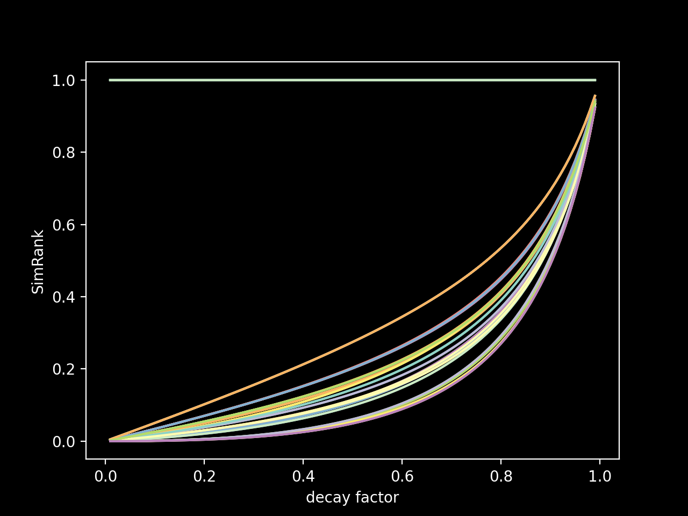
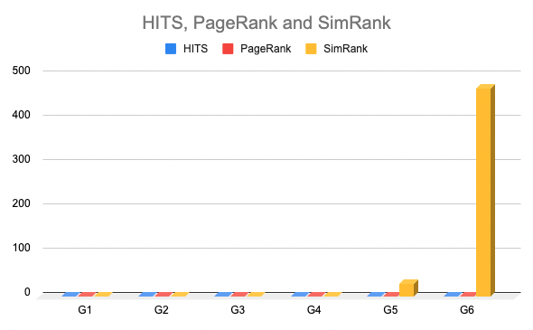
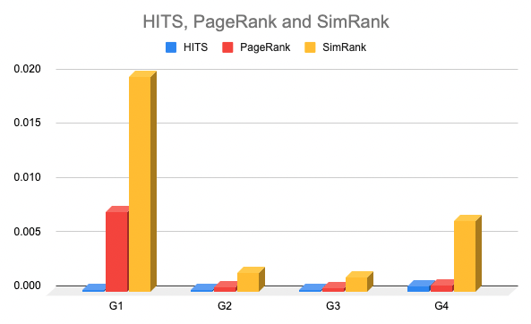

# Data Mining HomeWork 3
Name: VS6102093 葉家任

## Implementation detail
The Directory Structure is shown as follows.
```
./
├── datasets/
│   ├── graph_1.txt    
│   ├── graph_2.txt
│   ├── graph_3.txt
│   ├── graph_4.txt
│   ├── graph_5.txt
│   ├── graph_6.txt
│   └── ibm.txt
├── src/
│   ├── graph.py
│   ├── HITS.py
│   ├── PageRank.py
│   ├── path.py
│   ├── SimRank.py
│   └── temp...
└── README.md
```
### Environment
`python 3.8`, `numpy`, `matplotlib`
### Run Implementation code
#### HITS
- Bash script
    ```sh=
    $ python3 src/HITS.py
    $ python3 src/HITS.py --dataset 1
    $ python3 src/HITS.py --itr 50
    ```
    - `--dataset` Use to point at specific dataset.
        - Available Datasets:
          - `1`, `2`, `3`, `4`, `5`, `6` 
          - default is `example` which contain graph_1.txt ~ graph_3.txt
    - `--itr` Set number of iterations.
    - `--add_edges` Add new edges to the graph
        - e.g. 
        ```
        --add_edges 1,2 2,3
        ```
        -  will be parse to list 
        ```python
            [[1,2], [2,3]]
        ```      
    - `--ignore_edges` Ignore edges from the graph.
- Standard output

    
#### PageRank
- Bash script
    ```sh=
    $ python3 src/PageRank.py
    ```
- Standard output

    
#### SimRank
- Bash script
    ```sh=
    $ python3 src/SimRank.py
    ```
- Standard output

    
## Reports
### Find a way (e.g., add/delete some links) to increase hub, authority, and PageRank of Node 1 in first 3 graphs respectively.    
- Increase Hub of Node 1
    - Description
      - 根據Hub值的計算方式，我們可以推斷增加`Node1`的子節點能夠提升`Node1`的Hub值
      - 透過以設置好的`add_edges`參數，加入 Edge (1, 3)
    - Bash script
        ```sh=
        $ python src/HITS.py --add_edges 1,3
        ```
    - Output
      
      
    - Compare Table
        | Graph | Add Edge | Before Hub | After Hub|
        |-|-|-|-|
        | graph_1.txt | (1, 3) | 0.2 | 0.61803 |
        | graph_2.txt | (1, 3) | 0.2 | 0.61803 |
        | graph_3.txt | (1, 3) | 0.30902 | 0.33826 |
- Increase Authority of Node 1
    - Description
      - 根據Auth值的計算方式，我們可以推斷增加`Node1`的父節點能夠提升`Node1`的Auth值
      - 透過以設置好的`add_edges`參數，加入 Edge (3, 1)
    - Bash script
        ```sh=
        $ python3 src/HITS.py --add_edges 3,1
        ``` 
    - Output

        
    - Compare Table
        | Graph | Add Edge | Before Auth | After Auth|
        |-|-|-|-|
        | graph_1.txt | (3, 1) | 0   | 0.5 |
        | graph_2.txt | (3, 1) | 0.2 | 0.61803 |
        | graph_3.txt | (3, 1) | 0.19098 | 0.33826 |
- Increase PageRank of Node 1
    - Description
      - 根據PageRank值的計算方式，我們一樣可以推斷出增加`Node1`的父節點能夠提升`Node1`的PageRank值
      - 同樣透過以設置好的`add_edges`參數，加入 Edge (3, 1)
    - Bash script
        ```sh=
        $ python3 src/PageRank.py --add_edges 3,1
        ``` 
    - Output

        
    - Compare Table
        | Graph | Add Edge | Before Auth | After Auth|
        |-|-|-|-|
        | graph_1.txt | (3, 1) | 0.06716 | 0.16828387 |
        | graph_2.txt | (3, 1) | 0.2 | 0.2500706 |
        | graph_3.txt | (3, 1) | 0.17543 | 0.26160192 |
### Algorithm description 
#### HITS
- Implementation Code
    - `graph.py`
    - `HITS.py`
- 1. Start with each node having a hub score and authority score of 1.
    - Initialize the hub and authority score when implement the `Node` class, as below:
    ```python
        # graph.py
        class Node:
            def __init__(self, data):
                self.vertex = data
                self.auth = 1   ## INITIALIZE Authority(step1)
                self.hub = 1    ## INITIALIZE Hub (step1)
                self.page_rank = 1
                self.children_nodes_key = []
                self.parents_nodes_key = []
    ```
- 2. Run the authority update rule. (The sum of the hub of its parents nodes.)    
- 3. Run the hub update rule. (The sum of the authority of its children nodes.)
    ```python
    def HubsAndAuthorities(graph, k):    
    for _ in range(k):
        # Calculate auth
        for node in graph.nodes:
            if node == None:
                continue            
            node.auth = 0
            
            # The sum of the hub of its parents nodes. (step2)
            for p_key in node.parents_nodes_key:
                node.auth += graph.nodes[p_key].hub
            
        # Calculate hub
        for node in graph.nodes:
            if node == None:
                continue
            
            node.hub = 0
            
            # The sum of the authority of its children nodes. (step3)
            for c_key in node.children_nodes_key:            
                node.hub += graph.nodes[c_key].auth  
    ```
- 4. Run Iteration.
- 5. Normalize the authority and hub to all of the node in the graph.
    ```python
    def get_result(graph):
        hub_result = {}
        auth_result = {}
        hub_sum = 0
        auth_sum = 0
        for v in range(graph.vertices_num):
            if v == 0 or graph.nodes[v] == None:
                continue
            v_node = graph.nodes[v]
        
            hub_result[v_node.vertex] = v_node.hub
            hub_sum+= v_node.hub
            auth_result[v_node.vertex] = v_node.auth
            auth_sum+= v_node.auth
        
        for v in hub_result.keys():
            hub_result[v] = hub_result[v] / hub_sum     # NORMALIZE Hub Score
            auth_result[v] = auth_result[v] / auth_sum  # NORMALIZE Authority Score
    ```
#### PageRank
- 1. Start with each node having a PageRank score of 1.
    - Initialize the PageRank score when implement the `Node` class, as below:
    ```python
        # graph.py
        class Node:
            def __init__(self, data):
                self.vertex = data
                self.auth = 1   
                self.hub = 1    
                self.page_rank = 1 ## INITIALIZE PageRank(step1)
                self.children_nodes_key = []
                self.parents_nodes_key = []
    ```
- 2. Run the PageRank update rule. (The sum of the proportional rank of all of its parents.)
- 3. Random jumping to the new PageRank value.
    - equation:
    
        
    - code:
        ```python
        def PageRank(graph, k, damping_factor):    
            for _ in range(k):        
                for node in graph.nodes:
                    if node == None:
                        continue            
                    
                    parents = node.parents_nodes_key
                    
                    page_rank_sum = sum(
                        graph.nodes[parent].page_rank /\
                        len(graph.nodes[parent].children_nodes_key) \
                        for parent in parents
                    )

                    random_jumping = damping_factor / len(graph.nodes)
                    node.page_rank = random_jumping + (1 - damping_factor) * page_rank_sum
        ```
- 4. After enough iterations, the PageRank value will be converged.
- 5. Normalize the PageRank to all of the node in the graph.
    ```python
    def get_result(graph):
    page_rank_result = {}        
    total_pagerank_sum = 0
    
    for node in graph.nodes:
        if node == None:
            continue        
        total_pagerank_sum += node.page_rank
        
    for node in graph.nodes:
        if node == None:
            continue
        
        # Normalize
        page_rank_result[node.vertex] = node.page_rank / total_pagerank_sum
                
    return page_rank_result
    ```
#### SimRank
- 1. Initailize the Similarity Matrix with following rule:
    - If two node are the same, the similarity value is 1, else similarity value is 0.
    ```python
    def initialize_similarity_rank(graph):    
        init_similarity_matrix = []
        
        node_vertexs_indices = []
        for node in graph.nodes:
            if node == None:
                continue    
            node_vertexs_indices.append(node.vertex)
        
        for pair_node1 in graph.nodes:
            array1d = []
            for pair_node2 in graph.nodes:
                array1d.append(1 if pair_node1 == pair_node2 else 0)
                
            init_similarity_matrix.append(array1d)
        
        return init_similarity_matrix, node_vertexs_indices
    ```
- 2. Run the SimRank update rule. 
    - If two node are the same, the similarity value is 1, otherwise follow below equation:
    
    - $C$ is decay_factor, a constant between 0 and 1.
    - According to the equation, we calculate similarity by having **common parents**.
    - code:
    ```python
    def calculate_similarity_rank_sum(graph, pair_node1, pair_node2, 
                                  init_similarity_matrix, node_vertexs_indices, 
                                  decay_factor):
        sim_rank_sum = 0
        if pair_node1.vertex == pair_node2.vertex:
            sim_rank_sum = 1
            return sim_rank_sum
        
        if len(pair_node1.parents_nodes_key) == 0 or len(pair_node2.parents_nodes_key) == 0:
            return sim_rank_sum
        
        
        for p1 in pair_node1.parents_nodes_key:
            for p2 in pair_node2.parents_nodes_key:
                sim_rank_sum +=  init_similarity_matrix[
                    node_vertexs_indices.index(graph.nodes[p1].vertex)
                    ][
                    node_vertexs_indices.index(graph.nodes[p2].vertex)
                    ]
        
        # C / |I(a)||I(b)|
        scale = decay_factor / (len(pair_node1.parents_nodes_key) * len(pair_node2.parents_nodes_key))
        return sim_rank_sum * scale
    ```
### Result analysis and discussion 
- Graph 1

    
    | Measure Method | Description |
    |-|-|
    | HITS | Graph 1 是持續向前方向的圖型，其中 `2`, `3`, `4`, `5` 同時都有Parent與Chidren，而`1`只有Chidren沒有Parent，相反`6`只有Parent沒有Chidren，也因此根據Hub值的計算方法，`6`的Hub為0. 而根據Auth值的計算方法，`1`的Auth爲0.  |
    | PageRank | 根據PageRank的計算方式，若一Node的parents的數量越多，表示計算出來值會越來越大，因此在此Graph 1中，可以看到PageRank由`1`往`6`逐漸增大 |
    | SimRank | SimRank會去判斷Node之間是否擁有共同的parents以此來計算Node的相似度。但從Graph 1 來看，Node之間彼此並沒有共同parent，因此simRank只會在Node自身時為1 |
- Graph 2

    
    | Measure Method | Description |
    |-|-|
    | HITS | Graph 2 與 Graph 1 著要差異在於 `5` 直接連接上 `1`，使圖成為一個單方向的閉鎖循環，因此不會出現如同Graph 1 中 `6`的Hub值爲0，`1`的Auth值為0的狀況，每個Node的Auth與Hub 都是相同的。 |
    | PageRank | 在此單方向的閉鎖循環中，每個Node的parents數量與children數量都會相同，因此根據PageRank公式，也能夠計算出同樣的結果 |
    | SimRank | 與Graph 1狀況相同，Node間並沒有共同的parent，因此SimRank只在自身Node時為1  |
- Graph 3

    
    | Measure Method | Description |
    |-|-|
    | HITS | Graph 3上`1`與`4`的指向與被指向狀態是相同的，根據HITS的評分方式，可以計算出兩者會具有同樣的Auth與Hub值。同樣地，`2`與`3`的狀態也相同，因此兩者也同樣可得出一樣的結果。 |
    | PageRank | 與HITS類似，`1`與`4`在parents與children的數量是相同的，而`2`與`3`兩者同樣相同，因此`1`與`4`得到同樣的PageRank、`2`與`3`得到同樣的PageRank |
    | SimRank | Node 1 與 Node 3 有共同的parent: Node2 ; Node 2 與 Node 4 有共同的parent Node 3，因此可以得知上述兩個Pair間分別對Node 2 與 Node 3會有同樣的值 |

#### PageRank's damping factor & SimRank's decay factor
- Damping Factor
    
    
    - 根據 PageRank 公式，可以推論出隨著Damping Factor 絕對值數值越大，各個Node之間的差異會逐步減少，最終歸為同一分數。而此圖可以證明這個推論。
    
        

- Decay Factor

    
    - 我們將SimRank產出的Matrix值進行分析，將Matrix中的單一位置視為一條線來觀察SimRank的變化
    - 我們可以觀察到，除了自己對自己必定為1外，隨著decay factor設置值的提升，SimRank會逐步升高。
    - 接下來我們觀察SimRank的公式：

        
        - 當我們設置的Decay Factor 值越小，SimRank值就越小，反之，Decay Factor值越大，SimRank值就越大。
        - 值得注意的是，當Decay Factor 值過大或過小值，Matrix中之間的每個位置差異會不夠顯著，因此，若是想要得到較明顯的差異，將Decay Factor 設置於較適中的範圍內效果會比較明顯
#### General analysis
| METHOD | Strength | Weakness |
|-|-|-|
| HITS | HITS 演算法以 Hub 與 Authority 來分析Link之間的關係，可以較準確的找出連結的出處以及去向 | HITS算法比較難衡量Link出處與去向之間的交互關係 |
| PageRank | PageRank在其計算的函式中同時衡量parents與chidren(即出處與去向)間的關係，期望能比HITS多涵蓋更多資訊 | 並不像HITS能明確區分出分數的影響是來自於parents還是chidren上 |
| SimRank | 透過共同引用對象衡量對象間的相似度，來判斷兩者的性質差異。也為如：協同過濾等技術定下基礎 | 由於使用過多的For迴圈去窮舉各項連結之間的相似度，導致在執行效率上有很大的缺陷，可以針對此弱點進行改善 |
### Effectiveness analysis 
對各個資料集進行分析，此處會計算每次iterator所耗費的時間，以此來對演算法之間進行比較:
- 參數設定：
    - iteration times = 100
    - damping factor = 0.15
    - decay factor = 0.9
- Record Table
    | Datasets\Methods | HITS | PageRank | SimRank |
    |-|-|-|-|
    | Graph 1 | 0.0002117 | 0.0074031 | 0.0198819 |
    | Graph 2 | 0.0001995 | 0.0004562 | 0.0017722 |
    | Graph 3 | 0.0002167 | 0.0003877 | 0.0013509 |
    | Graph 4 | 0.000558 | 0.0006289 | 0.0065540 |
    | Graph 5 | 0.0527577 | 0.0298818 | 28.5144328 |
    | Graph 6 | 0.1926986 | 0.1059990 | 470.0428263 |
- IMG:

    
- Remove G5 & G6

    
- Complexity Analysis
    | Methods | Time Complexity |
    |-|-|
    | HITS | O(I * E)|
    | PageRank | O(I * E) |
    | SimRank | O(I * N^4) |
    - `I`: Iteration Number.
    - `N`: Node Number.
    - `E`: Edge Number.
- 在理論上推論出來的時間複雜度如上，但實際觀察自己實作的程式碼，HITS所需時間為O(I * E * 2)，為計算Hub 與 Auth 後的時間。而PageRank在每次Edge計算時，因需要在去該Node下搜尋Parents的數量，所以推估其實際時間複雜度會較HITS來的更多。而實驗結果如上圖IMG也可應證這個猜想。
### Discussion and experience
本來在實作的過程中，不太理解為何需要實作這些有相當歲月的程式碼。但在閱讀這些演算法的歷史後，能夠逐漸了解這些演算法的存在意義。
例如PageRank能夠彌補HITS本身的缺陷，而SimRank又與後來在推薦系統上佔據一席之地的協同過濾(Collaborative Filtering)息息相關。在仔細閱讀並實作SimRank的演算法後，確實能在SimRank上看到協同過濾的影子(或者說反過來)，並且也能推敲出協同過濾納入矩陣分解而生的MF(Matrix Factorization)更能解決在CF與SimRank的常看到效能問題，並更近ㄧ步提升了預測的精準度。