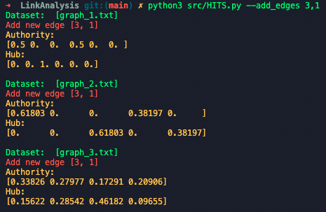

# Data Mining HomeWork 3
Name: VS6102093 葉家任

## Implementation detail
The Directory Structure is shown as follows.
```
./
├── datasets/
│   ├── graph_1.txt    
│   ├── graph_2.txt
│   ├── graph_3.txt
│   ├── graph_4.txt
│   ├── graph_5.txt
│   ├── graph_6.txt
│   └── ibm.txt
├── src/
│   ├── graph.py
│   ├── HITS.py
│   ├── PageRank.py
│   ├── path.py
│   ├── SimRank.py
│   └── temp...
└── README.md
```
### Environment
`python 3.8`, `numpy`
### Run Implementation code
#### HITS
- Bash script
    ```sh=
    $ python3 src/HITS.py
    $ python3 src/HITS.py --dataset 1
    $ python3 src/HITS.py --itr 50
    ```
    - `--dataset` Use to point at specific dataset.
        - Available Datasets:
          - `1`, `2`, `3`, `4`, `5`, `6` 
          - default is `example` which contain graph_1.txt ~ graph_3.txt
    - `--itr` Set number of iterations.
    - `--add_edges` Add new edges to the graph
        - e.g. 
        ```
        --add_edges 1,2 2,3
        ```
        -  will be parse to list 
        ```python
            [[1,2], [2,3]]
        ```      
    - `--ignore_edges` Ignore edges from the graph.
- Standard output

    
#### PageRank
- Bash script
    ```sh=
    $ python3 src/PageRank.py
    ```
- Standard output

    
#### SimRank
- Bash script
    ```sh=
    $ python3 src/SimRank.py
    ```
- Standard output

    
## Reports
### Find a way (e.g., add/delete some links) to increase hub, authority, and PageRank of Node 1 in first 3 graphs respectively.    
- Increase Hub of Node 1
    - Description
      - 根據Hub值的計算方式，我們可以推斷增加`Node1`的子節點能夠提升`Node1`的Hub值
      - 透過以設置好的`add_edges`參數，加入 Edge (1, 3)
    - Bash script
        ```sh=
        $ python src/HITS.py --add_edges 1,3
        ```
    - Output
      
      
    - Compare Table
        | Graph | Add Edge | Before Hub | After Hub|
        |-|-|-|-|
        | graph_1.txt | (1, 3) | 0.2 | 0.61803 |
        | graph_2.txt | (1, 3) | 0.2 | 0.61803 |
        | graph_3.txt | (1, 3) | 0.30902 | 0.33826 |
- Increase Authority of Node 1
    - Description
      - 根據Auth值的計算方式，我們可以推斷增加`Node1`的父節點能夠提升`Node1`的Auth值
      - 透過以設置好的`add_edges`參數，加入 Edge (3, 1)
    - Bash script
        ```sh=
        $ python3 src/HITS.py --add_edges 3,1
        ``` 
    - Output

        
    - Compare Table
        | Graph | Add Edge | Before Auth | After Auth|
        |-|-|-|-|
        | graph_1.txt | (3, 1) | 0   | 0.5 |
        | graph_2.txt | (3, 1) | 0.2 | 0.61803 |
        | graph_3.txt | (3, 1) | 0.19098 | 0.33826 |
- Increase PageRank of Node 1
    - Description
      - 根據PageRank值的計算方式，我們一樣可以推斷出增加`Node1`的父節點能夠提升`Node1`的PageRank值
      - 同樣透過以設置好的`add_edges`參數，加入 Edge (3, 1)
    - Bash script
        ```sh=
        $ python3 src/PageRank.py --add_edges 3,1
        ``` 
    - Output

        
    - Compare Table
        | Graph | Add Edge | Before Auth | After Auth|
        |-|-|-|-|
        | graph_1.txt | (3, 1) | 0.06716 | 0.16828387 |
        | graph_2.txt | (3, 1) | 0.2 | 0.2500706 |
        | graph_3.txt | (3, 1) | 0.17543 | 0.26160192 |
### Algorithm description 
#### HITS
- Implementation Code
    - `graph.py`
    - `HITS.py`
- 1. Start with each node having a hub score and authority score of 1.
    - Initialize the hub and authority score when implement the `Node` class, as below:
    ```python
        # graph.py
        class Node:
            def __init__(self, data):
                self.vertex = data
                self.auth = 1   ## INITIALIZE Authority(step1)
                self.hub = 1    ## INITIALIZE Hub (step1)
                self.page_rank = 1
                self.children_nodes_key = []
                self.parents_nodes_key = []
    ```
- 2. Run the authority update rule. (The sum of the hub of its parents nodes.)    
- 3. Run the hub update rule. (The sum of the authority of its children nodes.)
    ```python
    def HubsAndAuthorities(graph, k):    
    for _ in range(k):
        # Calculate auth
        for node in graph.nodes:
            if node == None:
                continue            
            node.auth = 0
            
            # The sum of the hub of its parents nodes. (step2)
            for p_key in node.parents_nodes_key:
                node.auth += graph.nodes[p_key].hub
            
        # Calculate hub
        for node in graph.nodes:
            if node == None:
                continue
            
            node.hub = 0
            
            # The sum of the authority of its children nodes. (step3)
            for c_key in node.children_nodes_key:            
                node.hub += graph.nodes[c_key].auth  
    ```
- 4. Run Iteration.
- 5. Normalize the authority and hub to all of the node in the graph.
    ```python
    def get_result(graph):
        hub_result = {}
        auth_result = {}
        hub_sum = 0
        auth_sum = 0
        for v in range(graph.vertices_num):
            if v == 0 or graph.nodes[v] == None:
                continue
            v_node = graph.nodes[v]
        
            hub_result[v_node.vertex] = v_node.hub
            hub_sum+= v_node.hub
            auth_result[v_node.vertex] = v_node.auth
            auth_sum+= v_node.auth
        
        for v in hub_result.keys():
            hub_result[v] = hub_result[v] / hub_sum     # NORMALIZE Hub Score
            auth_result[v] = auth_result[v] / auth_sum  # NORMALIZE Authority Score
    ```
#### PageRank
- 1. Start with each node having a PageRank score of 1.
    - Initialize the PageRank score when implement the `Node` class, as below:
    ```python
        # graph.py
        class Node:
            def __init__(self, data):
                self.vertex = data
                self.auth = 1   
                self.hub = 1    
                self.page_rank = 1 ## INITIALIZE PageRank(step1)
                self.children_nodes_key = []
                self.parents_nodes_key = []
    ```
- 2. Run the PageRank update rule. (The sum of the proportional rank of all of its parents.)
- 3. Random jumping to the new PageRank value.
    - equation:
    
        
    - code:
        ```python
        def PageRank(graph, k, damping_factor):    
            for _ in range(k):        
                for node in graph.nodes:
                    if node == None:
                        continue            
                    
                    parents = node.parents_nodes_key
                    
                    page_rank_sum = sum(
                        graph.nodes[parent].page_rank /\
                        len(graph.nodes[parent].children_nodes_key) \
                        for parent in parents
                    )

                    random_jumping = damping_factor / len(graph.nodes)
                    node.page_rank = random_jumping + (1 - damping_factor) * page_rank_sum
        ```
- 4. After enough iterations, the PageRank value will be converged.
- 5. Normalize the PageRank to all of the node in the graph.
    ```python
    def get_result(graph):
    page_rank_result = {}        
    total_pagerank_sum = 0
    
    for node in graph.nodes:
        if node == None:
            continue        
        total_pagerank_sum += node.page_rank
        
    for node in graph.nodes:
        if node == None:
            continue
        
        # Normalize
        page_rank_result[node.vertex] = node.page_rank / total_pagerank_sum
                
    return page_rank_result
    ```
#### SimRank
- 1. Initailize the Similarity Matrix with following rule:
    - If two node are the same, the similarity value is 1, else similarity value is 0.
    ```python
    def initialize_similarity_rank(graph):    
        init_similarity_matrix = []
        
        node_vertexs_indices = []
        for node in graph.nodes:
            if node == None:
                continue    
            node_vertexs_indices.append(node.vertex)
        
        for pair_node1 in graph.nodes:
            array1d = []
            for pair_node2 in graph.nodes:
                array1d.append(1 if pair_node1 == pair_node2 else 0)
                
            init_similarity_matrix.append(array1d)
        
        return init_similarity_matrix, node_vertexs_indices
    ```
- 2. Run the SimRank update rule. 
    - If two node are the same, the similarity value is 1, otherwise follow below equation:
    
    - $C$ is decay_factor, a constant between 0 and 1.
    - code:
    ```python
    def calculate_similarity_rank_sum(graph, pair_node1, pair_node2, 
                                  init_similarity_matrix, node_vertexs_indices, 
                                  decay_factor):
        sim_rank_sum = 0
        if pair_node1.vertex == pair_node2.vertex:
            sim_rank_sum = 1
            return sim_rank_sum
        
        if len(pair_node1.parents_nodes_key) == 0 or len(pair_node2.parents_nodes_key) == 0:
            return sim_rank_sum
        
        
        for p1 in pair_node1.parents_nodes_key:
            for p2 in pair_node2.parents_nodes_key:
                sim_rank_sum +=  init_similarity_matrix[
                    node_vertexs_indices.index(graph.nodes[p1].vertex)
                    ][
                    node_vertexs_indices.index(graph.nodes[p2].vertex)
                    ]
        
        # C / |I(a)||I(b)|
        scale = decay_factor / (len(pair_node1.parents_nodes_key) * len(pair_node2.parents_nodes_key))
        return sim_rank_sum * scale
    ```
### Result analysis and discussion 
    [10 pt]
- 說明每個圖 (Graph 1~3) 的結果並討論
    - Graph 1
    - Graph 2
    - Graph 3
#### 針對不同 damping factor 或 decay factor 討論
#### General analysis
### Effectiveness analysis 
    [5pts]
### Discussion and experience
    [5pts]


