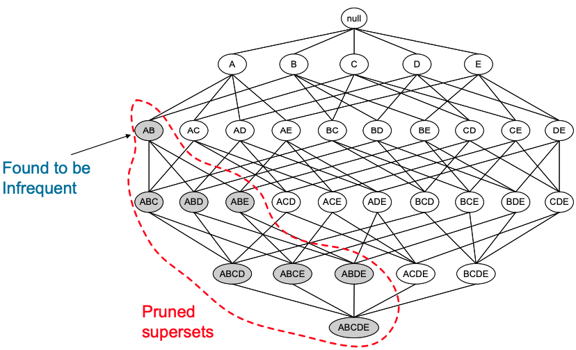

# Apriori Algorithm
## Observation 
- All non-empty subsets of a frequent itemset must also be frequent.

- Apriori principle **holds** due to the following property of the support measure:
    $$
        \forall X, Y:(X \subseteq Y) \Rightarrow s(X) \geq s(Y)
    $$
    - holds (成立)
    - Support of an itemset never exceeds the support of its subsets.
      - known as the `anti-monotone` property of support
- S`chematic diagram
    
- Notations
  - $C_k$: Candidate k-itemset means possible frequent kitemsets (denoted as $C_k$).
  - $L_k$: Frequent k-itemset means satisfy minimum support (denoted as $L_k$).
- How to  Generate Candidates $C_k$?
  - Step 1. self-joining $L_k$
  - Step 2. pruning
  - Progress:
    $$
    C_1 \rightarrow L_1 \rightarrow C_2 \rightarrow L_2 \rightarrow ... \rightarrow C_n \rightarrow L_n
    $$
- Challenges and Weaknesses
  - Multiple scan of transaction database
  - Huge number of candidates C_n
  - *Tedious* workload of support counting for candidates